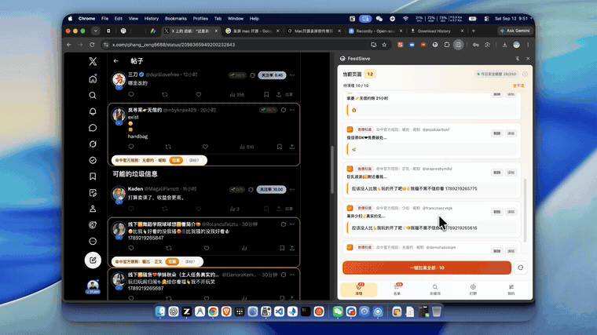

<p align="center">
  
</p>

<h1 align="center">福滤娃 FeedSieve</h1>

<p align="center">
  <strong>用了福滤娃，评论区不骚了，也不黑了。</strong><br>
  开源的 X（Twitter）降妖除魔扩展：黄推一眼现形，一键全端超度，误杀随时捞回。
</p>

<p align="center">
  <a href="https://chromewebstore.google.com/detail/feedsieve/amhdjglnonjaoenddnifpnljgmocfdph"></a>
  <a href="https://chromewebstore.google.com/detail/feedsieve/amhdjglnonjaoenddnifpnljgmocfdph"></a>
  <a href="https://github.com/realchendahuang/feedsieve/stargazers"></a>
  <a href="https://github.com/realchendahuang/feedsieve/releases"></a>
  <a href="LICENSE"></a>
  <a href="https://github.com/realchendahuang/feedsieve/commits/main"></a>
  <a href="CONTRIBUTING.md"></a>
</p>

<p align="center">
  <a href="https://chromewebstore.google.com/detail/feedsieve/amhdjglnonjaoenddnifpnljgmocfdph"><strong>⬇️ Chrome 商店一键安装</strong></a>
  ·
  <a href="https://feedsieve.win"><strong>🌐 官网与公示</strong></a>
  ·
  <a href="https://feedsieve.win/guide">使用教程</a>
  ·
  <a href="https://feedsieve.win/lists/blacklist">3,144条黑名单</a>
  ·
  <a href="https://feedsieve.win/lists/keywords">778条开源词库</a>
  ·
  <a href="https://feedsieve.win/lists/ranked">打野天梯榜</a>
  ·
  <a href="CHANGELOG.md">更新日志</a>
</p>

<p align="center">
  
</p>

---

## 中文 X 现状：白天当打工人，晚上当扫街城管

在中文推特刷稍微有点热度的推文，评论区几乎逃不过这几尊大佛：
1. **黄推复读机**：开局一句“那一夜你没有拒绝我不是人机 1827361928”，简介挂着“娇妻媚儿想找单男看我置顶🍑”；
2. **币圈引流怪**：“跟着老师布局已翻十倍，进裙免费领财富密码”；
3. **黑产僵尸号**：复制别人的正经高赞推文，洗稿抢前排赚流量补贴。

马斯克天天吹 Grok 解决推特水军，结果中文评论区的水军比真人还多。大家试过的自救工具往往走入两个极端：
- **纯本地隐藏（`display: none`）——鸵鸟战术**：
  电脑网页上眼睛闭起来当全世界穿了衣服。一掏出手机 App 刷推，黄推照样骑脸；最离谱的是对方依然能 @ 你、私信你、在你的推文下欢快开 party。
- **传统拉黑脚本——赛博秦城 + 伤敌八百自损一千**：
  规则是黑盒，作者看谁不顺眼就拉黑谁；哪天误杀了正常博主，谁都不知道，博主在小黑屋里喊冤都没人听得见；更绝的是许多脚本用 `forEach` 无脑狂轰接口，黄推还没超度几个，推特反手把你账号给封了——“我治不了满屏水军，我还治不了你手速太快？”

**福滤娃（FeedSieve）专治这种不服：**
- **不骚了**：精准识别并调用推特原生 Block 物理超度，全端同步清空，掐断一切骚扰；
- **也不黑了**：全量规则公开明牌，拒绝黑盒暗箱，误杀秒级抢救，内置 400 发子弹安全配额防封号。

| 方案大比拼 | 本地折叠隐藏 | 传统黑盒拉黑脚本 | **福滤娃 FeedSieve** |
|---|---|---|---|
| **生效范围** | 仅当前电脑网页有效 | 全端同步 | **全端同步（手机、平板、客户端彻底清静）** |
| **物理防骚扰** | ❌ 对方依然能 @ 你、私信你 | ✅ 阻断互动 | **✅ 物理级阻断，对方连视奸你的机会都没了** |
| **视觉交互** | 暴力删节点，你啥也不知道 | 静默自动暗杀，全程黑盒 | **只打醒目黄框，明牌贴出判定理由，内容原样展示** |
| **杀生大权** | 无（单纯眼不见为净） | 插件擅自做主 | **行刑权交给你：手动顺手拉黑，手滑一键放回** |
| **误伤救助** | 误判无法感知 | 申诉无门（直接判无期徒刑） | **误伤一键 Unblock 原路放回，社区抢救秒级全网赦免** |
| **规则透明度** | 几条写死的本地正则 | 闭源私服，拉黑全凭作者喜好 | **全量开源公示：3,144 个黑名单与 778 条词库明牌贴在官网上** |
| **账号安全** | 不调接口无风险 | 粗暴并发，推特立刻送你 429 封号礼包 | **400发/天滚动限额 + 拟人化抖动 + 429 自动装死熔断** |
| **心理体验** | 越看越恶心，赛博精神内耗 | 机械枯燥的扫垃圾杂役 | **反客为主进野区刷怪：拿首杀、打排位、攒积分当大娃** |

---

## 它是怎么治这帮机器人的？

### 1. 黄框标出，把行刑权交给你（绝不擅自折叠内容）
刷推时插件**绝对不擅自隐藏任何推文内容**。
- 命中了黑名单或特征词库的账号，只会在时间线上打上**非常显眼的亮黄框**，并在底下贴出抓包依据（例如 `[命中黑名单: 3人标记]`、`[全角变形特征: 那一夜你没有拒绝我]`）；
- 完整内容原样留给你看，要不要送走它，完全由你说了算；
- 手滑点错了？在历史记录里点一下「放回来」，原生 Unblock 秒级撤销，不留任何心理负担。

### 2. 原生 Block，全端同步超度
本地 `display: none` 骗得了谁？福滤娃直接借用你在浏览器中已登录的 X 会话，调用推特原生 Block 接口：
- 手机 App、平板、网页端全平台同步直接清空；
- 彻底斩断关系链：被拉黑的账号再也无法回复你、@ 你、转发你或向你发私信，物理级失联。

### 3. 拒绝黑盒审判，规则全量明牌公示
谁也没有资格当中文互联网的暗黑仲裁官。福滤娃坚持所有依据在阳光下晒出来：
- 📜 **[社区黑名单全量公开](https://feedsieve.win/lists/blacklist)**：3,144 个社区标记的垃圾号明牌检索，公开展示票数、推文原证与关联引流域名；
- 📖 **[开源词库全量公开](https://feedsieve.win/lists/keywords)**：8 大行业包共 778 条正则与词库全部开源，任何人都能在网页端直接挑刺、提 PR 或补词；
- 🛡️ **[误伤申诉与白名单](https://feedsieve.win/lists/whitelist)**：正常博主被误标？社区抢救票压倒举报后秒级全网解封，也随时可在 [申诉入口](https://feedsieve.win/lists/apply) 递交复核；
- 🔐 **Ed25519 纯数学验签**：名单分发带数字签名，本地防篡改与防版本回滚，中间人想加私货门都没有。

### 4. 每天 400 发子弹配额，防推特反向风控
推特官方天天治不了满屏黄推，但对正常用户拉黑频次抓得比谁都严。福滤娃给你的账号穿上了防弹衣：
- 24 小时 400 条滚动拉黑额度，拉黑操作加入了拟人化随机延迟（300ms ~ 1200ms）；
- 后台状态机一旦撞见推特吐 429（Rate Limit Exceeded），立即自动装死熔断并休眠，绝不硬打，保住你的推特大号不被风控。

### 5. 评论区打野排位（Hunting）：把吃苍蝇变成刷野怪
既然天天免不了在评论区撞见这帮孙子，不如反客为主把它们当野怪刷了：
- 揪出新变种样本拿下**首杀（First Blood）**，送走公认垃圾号计入**击杀**；
- 头衔一路晋级：`滤福娃` → `鞭福娃` → `滤福侠` → `鞭福侠` → `滤福王` → `鞭福王中王`；
- 每周天梯榜公布在 [feedsieve.win/lists/ranked](https://feedsieve.win/lists/ranked)，前 7 名尊享葫芦娃角色徽标（大娃到七娃），8-50 名合体为小金刚；
- **防刷分倒扣机制**：想恶意标记正常人刷榜？一旦被社区翻案，立刻双倍扣分（-2 分），数学期望恒为负，老老实实打野才是正道。

### 6. 原文不出设备，偷看隐私算我输
- 词库归一化与 SimHash 模糊指纹计算全部在浏览器沙箱本地执行；
- 推文正文、个人私信、关注列表和浏览记录**绝对不会上传**；
- 社区上报仅限 Handle、单向哈希特征与外链域名，双语隐私政策详见 [`PRIVACY.md`](PRIVACY.md)。

---

## 四步上手，装好即爽

1. **刷推看黄框**：打开 `x.com` 正常冲浪，垃圾账号自动被打上黄框并附带罪证，推文原样展示；
2. **顺手送走它**：看到黄框嫌碍眼，点右上角「顺手拉黑」，走当前会话直调原生接口，手机端同步消失；
3. **批量大扫除**：攒了一堆不想挨个点？打开扩展弹窗，点「一键拉黑全部」，后台状态机按安全节奏稳稳送走；
4. **手滑捞回来**：拉错了不慌，弹窗「已拉黑」里点一下「放回来」，原生 Unblock 秒级放生。

详细图文指南见 [docs/USAGE.md](docs/USAGE.md) 或 [网页版使用指南](https://feedsieve.win/guide)。

---

## 安装方式

| 安装途径 | 说明与步骤 |
|---|---|
| **Chrome 应用商店（强烈推荐）** | 直达 [Chrome 商店页面](https://chromewebstore.google.com/detail/feedsieve/amhdjglnonjaoenddnifpnljgmocfdph) 点击「添加至 Chrome」，自动接收后续版本更新 |
| **Edge / Brave 等 Chromium 浏览器** | 直接访问上方 Chrome 商店链接，提示「允许来自其他商店的扩展」后点添加即可，无需额外步骤 |
| **GitHub Releases** | 从 [Releases 页面](https://github.com/realchendahuang/feedsieve/releases) 下载 `feedsieve-*-chrome.zip` 解压 → 访问 `chrome://extensions` 开启开发者模式 → 点击「加载已解压的扩展程序」 |
| **从源码自行构建** | 见下方本地开发指南（需要 Node ≥ 22 与 pnpm） |

---

## 系统工作流程

```text
x.com 页面
  │
  ├── [MAIN World] XHR Bridge ──> 拦截公开 GraphQL 响应 (解析 rest_id / handle)
  │                                    │
  │                                    ▼
  │                      [ISOLATED World] 检测流水线
  │                 ┌──────────────────┼──────────────────┐
  │                 ▼                  ▼                  ▼
  │          社区签名黑名单      远程订阅词库包       SimHash 模糊指纹
  │                 │                  │                  │
  │                 └──────────────────┼──────────────────┘
  │                                    │
  │                      selfHandle 自身账号绝对豁免
  │                      个人关注列表与白名单一票否决
  │                                    │
  │                           黄框标注（明牌贴理由，内容不藏）
  │                                    │
  │                           待拉黑池（持久化安全队列）
  │                                    │
  └── 用户按下「一键批量拉黑」 <─────────────┘
          │
          ▼
     [Block Queue 引擎]
          │
     24h 滚动预算门控 (400发子弹限额)
     拟人化泊松抖动 (300ms ~ 1200ms)
     遭遇 429 自动装死熔断挂起
          │
          ▼
     调用 X 内部 Block 端点 (全端同步消失 + 物理阻断互动)
```

---

## 本地开发与贡献

本项目采用 Monorepo 架构管理：

| 模块路径 | 职责与技术栈 |
|---|---|
| `apps/extension` | 扩展本体：采用 **WXT + React 19 + TypeScript**，纯 Manifest V3 架构 |
| `apps/community-api` | 社区后端：**Cloudflare Workers + Hono + D1 + R2**，支持 Ed25519 签名分发 |
| `apps/admin` | 维护后台：React + Tailwind，受 Cloudflare Access 身份断言保护 |
| `packages/detector` | 独立检测器纯逻辑与金标测试语料库（Golden Corpus） |
| `packages/block-queue` | 具备自适应退避与熔断特性的拉黑队列状态机 |
| `packages/x-adapter` | X 页面 DOM/网络读取与原生动作适配层 |
| `packages/community-lists`| 共享的社区名单序列化、解析与 Ed25519 验签契约 |
| `community/` | 规范的 YAML 名单源文件、Schema 与每日镜像快照 |

### 常用命令

```sh
git clone https://github.com/realchendahuang/feedsieve.git
cd feedsieve
pnpm install
git config core.hooksPath .githooks     # 启用本地 pre-push 质量门禁

pnpm verify                   # 执行全量质量门禁（Lint + Typecheck + 全量单测 + 扩展构建）
pnpm build:extension          # 编译扩展，产物位于 apps/extension/.output/chrome-mv3
pnpm keyword-packs:build      # 由公开 YAML 词库构建签名官方词库 JSON
```

贡献准则见 [`CONTRIBUTING.md`](CONTRIBUTING.md)，架构细节见 [`docs/ARCHITECTURE.md`](docs/ARCHITECTURE.md)。

---

## Star History

<p align="center">
  <picture>
    <source media="(prefers-color-scheme: dark)" srcset="https://api.star-history.com/svg?repos=realchendahuang/feedsieve&type=Date&theme=dark" />
    <source media="(prefers-color-scheme: light)" srcset="https://api.star-history.com/svg?repos=realchendahuang/feedsieve&type=Date" />
    
  </picture>
</p>

---

## 开源许可

本项目依据 [MIT License](LICENSE) 开源。
